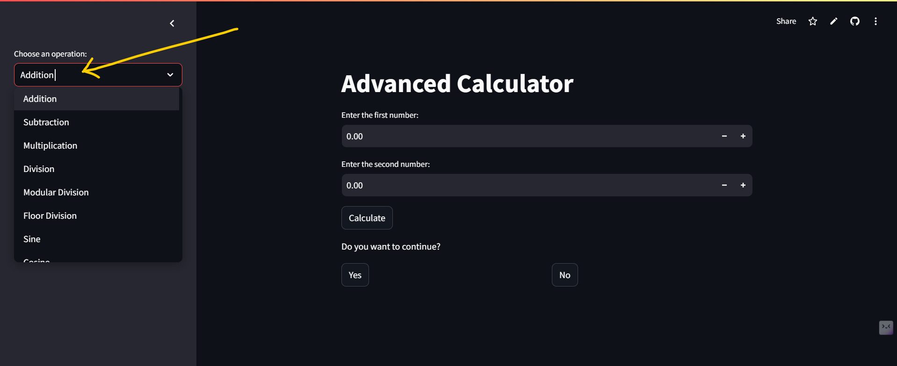
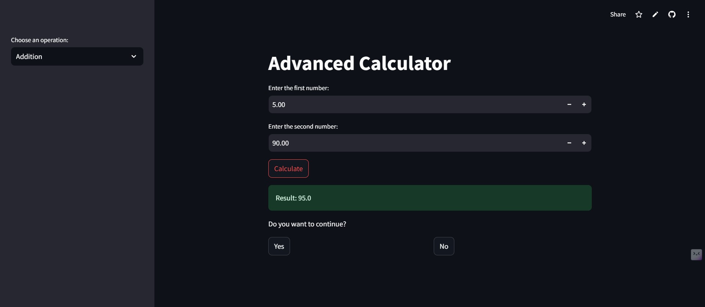
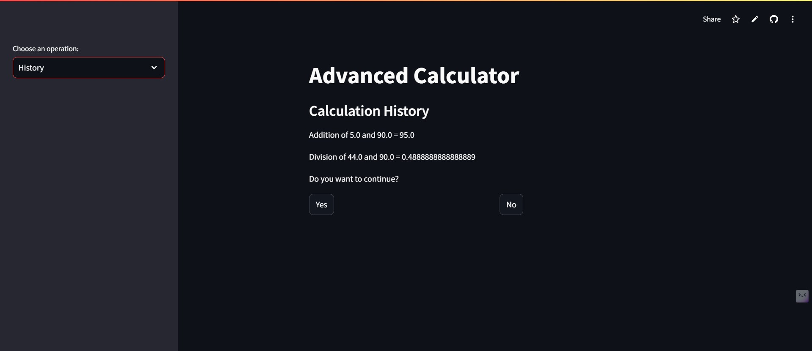
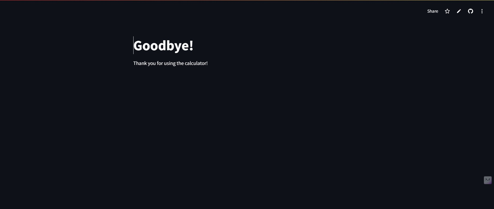

# Advanced Calculator App

## 📚 About the Project

This is an **Advanced Calculator App** built using **Streamlit** and Python, offering a wide range of mathematical functions. The app allows users to perform basic arithmetic operations (addition, subtraction, multiplication, etc.) and trigonometric calculations (sine, cosine, etc.) with a user-friendly interface. Additionally, the app saves the calculation history so users can refer to past operations.

### Aim:
The aim of this project is to provide an interactive calculator app with:
- Basic arithmetic and trigonometric operations.
- The ability to view calculation history.
- A user-friendly interface built with **Streamlit**.

---

## ⚙️ Tools Used

- **Python**: The core programming language used to build the logic behind the app.
- **Streamlit**: A powerful framework to create interactive web applications with minimal effort.
- **Mathematical Functions**: Operations like addition, subtraction, multiplication, division, floor division, trigonometric functions (sine, cosine, tangent), etc.
- **Session State**: To manage application state and persist history across multiple calculations.

---

## 🚀 Features

- **Basic Operations**: Addition, Subtraction, Multiplication, Division, Floor Division, Modular Division.
- **Trigonometric Functions**: Sine, Cosine, Tangent, Cotangent, Secant, Cosecant.
- **Calculation History**: Keep track of all previous calculations.
- **Interactive UI**: Simple and easy-to-use interface for selecting operations and inputting values.
- **Restart or Terminate**: Option to restart the app with initial values or terminate the session.

---

## 🖼️ Screenshots

### 1. **Choose an Operation**
When you open the app, the sidebar allows you to select an operation from a list.



---

### 2. **Performing a Calculation**
After choosing an operation, you will be prompted to enter the numbers. For example, here’s how the app looks when performing an addition.



---

### 3. **View History**
You can view your calculation history by selecting the "History" option. The history will list all calculations made during the session.



### 5. Click "No" to Terminate
After performing a calculation, you will be asked if you want to continue. If you click "No," the app will clear the screen and show a "Goodbye" message.



---

## 🛠️ How to Run the App

### Prerequisites

To run this app locally, you need Python installed on your machine. You also need to install the required libraries, which can be done via `pip`.

1. **Clone the repository**:

   ```bash
   git clone https://github.com/YourGitHubUsername/Calculator-App.git
   cd Calculator-App
   ```
   
2. **Create a Virtual Environment (Optional but recommended)**:

    ```bash
        python -m venv venv
        source venv/bin/activate  # On Windows, use `venv\Scripts\activate`
    ```

3.  **Install Dependencies**:

    ```bash
        pip install -r requirements.txt
    ```
4. **Run the App**:

    ```bash
        streamlit run app.py
    
  >This will start the app in your default browser.

## 🧑‍💻 How to Use

1. **Choose Operation**: On the left sidebar, select the operation you want to perform, such as Addition, Subtraction, or Trigonometric functions.
2. **Enter Numbers**: Input the numbers for basic operations or the angle (in degrees) for trigonometric calculations.
3. **Click on "Calculate"**: After entering the necessary values, click the "Calculate" button to get the result.
4. **View Results**: The result will be displayed immediately, and the history will be updated with your calculation.
5. **View History**: Select "History" to view all previous calculations made during the current session.
6. **Restart/Terminate**: After each calculation, you can choose to continue with a new calculation, restart the app, or terminate the session.

## 🤝 Contributing

If you want to contribute to this project, feel free to fork the repository, make changes, and create a pull request. All contributions are welcome!

---

## 💬 Contact

For any questions or suggestions, feel free to reach out:

*   Email: kd.codegeek@gmail.com
*   LinkedIn: [My LinkedIn Profile](https://www.linkedin.com/in/deepak-kumar-mohanty-09aa59230/)


